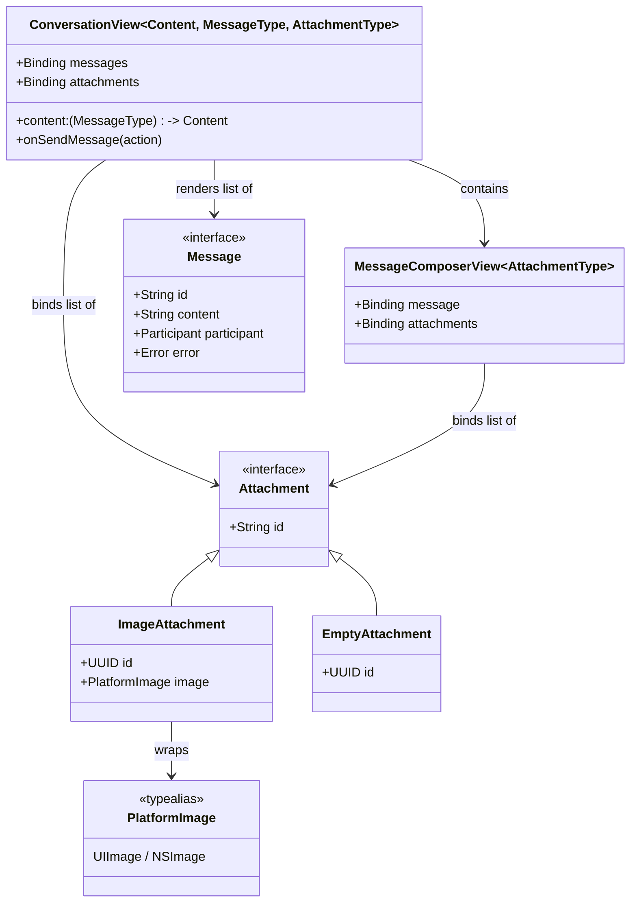
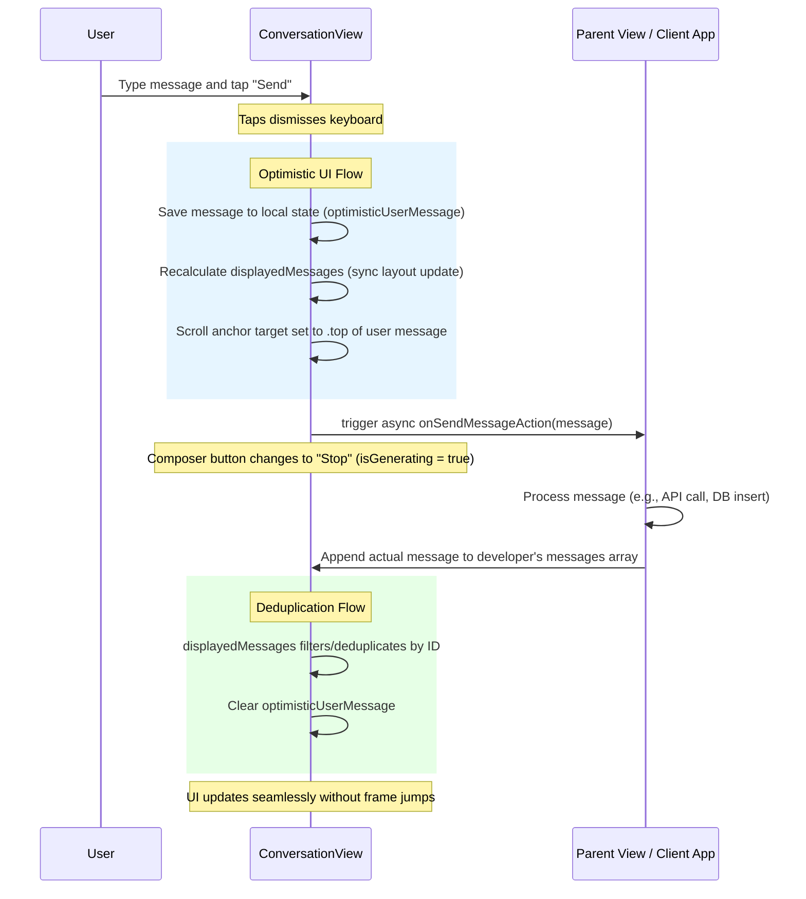

# Component: ConversationKit

## Component Overview

This component is the core of the `ConversationKit` library. It provides a customizable chat interface for iOS and macOS applications, built with SwiftUI. It's a cross-platform native component designed to be easily integrated into any SwiftUI application. The primary technology stack is Swift and SwiftUI.

## Key Files and Structure

The component is organized into three main directories: `Model`, `Platform`, and `Views`.

### Model
*   **`Model/Message.swift`**: Defines the data model for the chat interface. It includes the `Message` protocol and a default implementation, `DefaultMessage`. This protocol-based approach allows developers to use their own custom message types.
*   **`Model/Attachment.swift`**: Defines the `Attachment` protocol, which conforms to `Identifiable` and `Hashable`.
*   **`Model/ImageAttachment.swift`**: A concrete implementation of `Attachment` and `View` that renders a platform-native image wrapper.
*   **`Model/EmptyAttachment.swift`**: A concrete implementation of `Attachment` and `View` that renders an empty placeholder state.

### Platform
*   **`Platform/PlatformTypes.swift`**: Defines cross-platform type aliases following the Chameleon pattern. Centralizes platform differences (such as `UIImage` vs `NSImage` via `PlatformImage`, color utilities, and image construction) so SwiftUI views remain clean and cross-platform.

### Views
*   **`Views/ConversationView.swift`**: This is the main entry point to the library. It's a SwiftUI view that displays the conversation thread and the message composer. It's highly customizable and binds both a list of messages and a list of attachments.
*   **`Views/MessageComposerView.swift`**: This view provides the text input field, the send button, and the attachment menu.
*   **`Views/MessageView.swift`**: This is the default view for rendering a single message.
*   **`Views/AttachmentPreviewScrollView.swift`**: A horizontal scroll view rendered inside the composer that previews pending attachments.
*   **`Views/AttachmentPreviewCard.swift`**: A wrapper card for an attachment with a delete/close overlay, featuring concentric corner adjustments.
*   **`Views/ConversationEnvironment.swift`**: Defines environment values and modifiers for advanced customization (`messageActions` and `conversationDisclaimer`).
*   **`Views/ErrorWrapper.swift`**, **`Views/OnErrorModifier.swift`**, and **`Views/PresentErrorAction.swift`**: These files provide a robust error handling mechanism.
*   **`Views/Utilities.swift`**: Contains utility extensions and views.

## Architecture Diagram



## SwiftUI Scroll Physics & Concurrency

`ConversationKit` implements a highly specialized, native scrolling UX matching modern conversational AI interfaces. When the user sends a message, it doesn't violently snap to the top. Instead, it rests comfortably above the text input field. As the AI begins generating its response directly below, the new text smoothly *pushes* the user's message upward until it hits the top navigation bar, at which point it securely *pins* in place, allowing the rest of the generated response to flow downwards off the screen.

To achieve this "Push and Pin" behavior entirely within SwiftUI's native declarative layout engine (without fragile `GeometryReader` clutches), we explicitly tell `.scrollPosition` to target the user's message with `anchor: .top`.

### Concurrency Optimization (Optimistic UI)
To make this work fluidly, the layout engine must process the new user message in the exact same render transaction as the keyboard dismissal. Because the SDK intentionally *does not own* the messages array, relying on developers to asynchronously append their messages inside the `async` `onSendMessage` closure caused a 1-frame layout micro-delay that completely broke the `.top` physics.

The SDK resolves this conflict via an **Optimistic UI anchor strategy**:



> **Important API Contract Note:** The deduplication logic relies explicitly on the `id` of the user's message. When the developer's `.onSendMessage` closure executes, they *must* append the exact `message` instance provided by the closure, or map it into a new model using the identical `message.id`. If they map the text into a completely new object with a randomly generated UUID, the deduplication engine will fail to recognize them as the same message, causing the message to briefly appear twice on screen before the optimistic placeholder expires.

## Usage and Integration

The main way to use this component is by embedding the `ConversationView` in a SwiftUI view hierarchy. The `ConversationView` takes a `Binding` to an array of `Message` objects, a `Binding` to an array of `Attachment` objects, and an `onSendMessage` closure to handle user input.

Here's a basic usage example with attachments:

```swift
import SwiftUI
import ConversationKit

struct ChatView: View {
    @State private var messages: [DefaultMessage] = []
    @State private var attachments: [ImageAttachment] = []
    @State private var showingPhotoPicker = false

    var body: some View {
        NavigationStack {
            ConversationView(messages: $messages, attachments: $attachments)
                .onSendMessage { userMessage in
                    // Clear attachments on send
                    attachments.removeAll()
                    // Handle the sent message asynchronously
                    await processMessage(userMessage)
                }
                .attachmentActions {
                    Button("Photos", systemImage: "photo.on.rectangle.angled") {
                        showingPhotoPicker = true
                    }
                }
                .navigationTitle("Chat")
                .navigationBarTitleDisplayMode(.inline)
        }
    }

    func processMessage(_ message: any Message) async {
        // Append the user's message to the messages array
        if let defaultMessage = message as? DefaultMessage {
          messages.append(defaultMessage)
        }
        // Simulate async response
        try? await Task.sleep(for: .seconds(1))
        await MainActor.run {
            messages.append(DefaultMessage(
                content: "You said: \(message.content ?? "")",
                participant: .other
            ))
        }
    }
}
```

## Important Notes

*   The `ConversationView` does not own the `messages` or `attachments` arrays. The parent view is responsible for creating, binding, and clearing them.
*   **Loading Indicators:** To display a loading state, simply append an AI (`.other`) message with a `nil` or empty `content`. `ConversationView` natively renders a loading view for this state without API breakage.
*   **Generation State (Send/Stop):** The composer's "Send" button will be disabled if the text field is empty. When `onSendMessage` executes, the "Send" button transforms into a "Stop" button. Tapping it calls `Task.cancel()` on the executing task. End-developers must rely on Swift's cooperative cancellation by checking `try Task.checkCancellation()` within any streaming loops to make the stop button functional.
